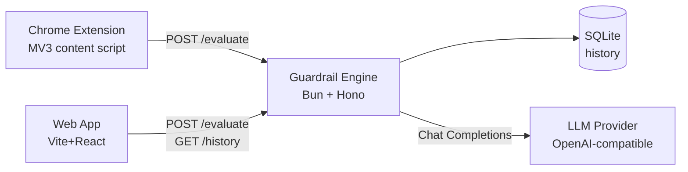
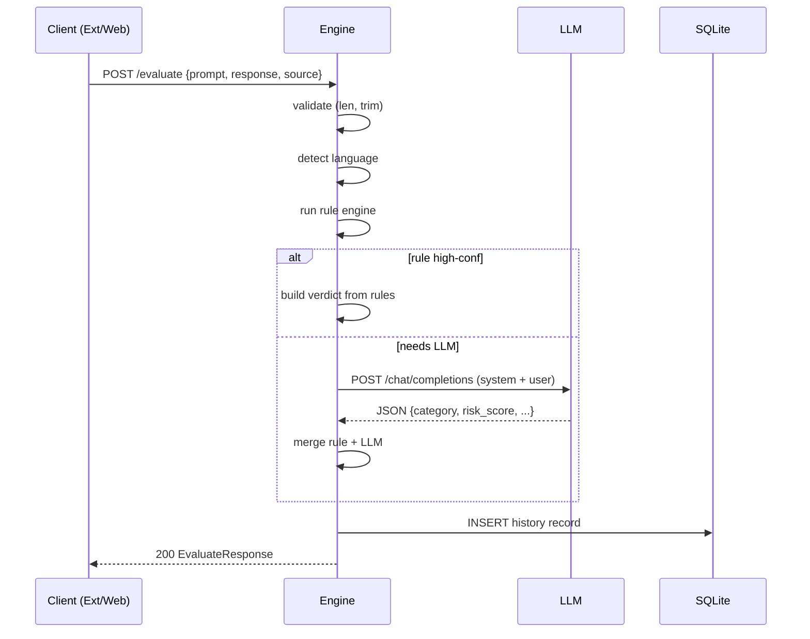

# Architecture

Responsible Chatbot Guardrail Tester — three components, one engine. This file is the system-level source of truth. Schema in `Data_Schema.md`, endpoints in `API_Contract.md`, rules in `Rule_Engine.md`, LLM judge in `LLM_System_Inst.md`.

---

## 1. Components

| Component | Runtime | Purpose |
|---|---|---|
| Guardrail Engine (backend) | Bun + Hono | Evaluate (prompt, response) → verdict |
| Web App (Developer Console) | Vite + React + TS | Manual + batch test, history dashboard |
| Chrome Extension | MV3 | Passive scan on AI chat sites, badge inject |

## 2. Tech Stack

| Layer | Choice | Why |
|---|---|---|
| Backend | Bun + Hono | Existing skeleton, fast, native TS, built-in `bun:sqlite` |
| Lang detection | `franc` + `tinyld` fallback | Pure-JS, no native bind, ISO 639-1 out |
| LLM judge | OpenAI-compatible Chat Completions | Provider-portable; Vultr-ready via env |
| Web app | Vite + React + TS + Tailwind | Fast dev, minimal config |
| Extension | MV3 content + service worker | Required by Chrome; no remote code |
| Storage | `bun:sqlite` | Zero-config, file at `DB_PATH` |

## 3. High-Level Architecture



Extension and Web App hit same REST contract (see `API_Contract.md`). Engine owns rule layer + LLM calls; never exposes LLM keys to clients.

## 4. Engine Pipeline

```mermaid
flowchart TD
  IN[Request<br/>prompt, response, source] --> VAL[Validate]
  VAL -->|bad| ERR[400 ErrorResponse]
  VAL -->|ok| LANG[Language Detection<br/>franc + tinyld]
  LANG --> RULE[Rule Engine<br/>regex/keyword per lang]
  RULE --> DEC{fired & high confidence?}
  DEC -->|yes| FIN[Build final verdict]
  DEC -->|no| LLMJUDGE{needs LLM?}
  LLMJUDGE -->|yes, API key set| LLM[LLM-as-Judge<br/>Chat Completions]
  LLMJUDGE|no key| FINLITE[Build final verdict<br/>rules-only fallback]
  LLM --> MERGE[Merge Logic<br/>max score, combine cats]
  MERGE --> FIN
  FIN --> STORE[Write HistoryRecord to SQLite]
  STORE --> OUT[EvaluateResponse JSON]
```

LLM invocation conditions (see `Rule_Engine.md` §6, `LLM_System_Inst.md` §3):
1. Rules did not fire
2. Detected language not in rule-supported set
3. Category needs nuance (bias, hallucination, unsupported claims)
4. Rule fired at medium/low confidence

If `LLM_API_KEY` unset → rules-only fallback, `llm_judge.invoked = false`, response still valid (degraded).

## 5. Request Lifecycle (sequence)



## 6. Repo Layout

```
tcs-hacks/
├─ backend/
│  ├─ src/
│  │  ├─ index.ts              # Hono app entry, route wiring, CORS
│  │  ├─ routes/
│  │  │  ├─ evaluate.ts        # POST /evaluate
│  │  │  ├─ batch.ts           # POST /evaluate/batch
│  │  │  ├─ history.ts         # GET /history
│  │  │  └─ health.ts          # GET /health, GET /languages
│  │  ├─ engine/
│  │  │  ├─ pipeline.ts        # orchestrate: detect → rules → LLM → merge
│  │  │  ├─ lang.ts            # franc + tinyld, ISO 639-1
│  │  │  ├─ rules/
│  │  │  │  ├─ index.ts        # rule registry, versioning
│  │  │  │  ├─ en-v1.ts        # English rule set
│  │  │  │  └─ types.ts        # Rule, RuleMatch interfaces
│  │  │  ├─ llm.ts             # OpenAI-compatible client + retry
│  │  │  ├─ merge.ts           # merge logic from Data_Schema.md §6
│  │  │  └─ schema.ts          # TS types mirroring Data_Schema.md
│  │  ├─ db/
│  │  │  ├─ sqlite.ts          # bun:sqlite open + migrations
│  │  │  └─ history.ts         # insert + query
│  │  ├─ config.ts             # env loading, defaults
│  │  └─ lib/
│  │     ├─ validate.ts        # request validation
│  │     └─ id.ts              # UUID v4
│  ├─ rules-data/              # JSON rule lists (mirror of en-v1.ts), editable
│  ├─ dataset.json             # synthetic test pairs (Dataset_Spec.md)
│  ├─ tests/                   # bun:test
│  ├─ .env.example
│  ├─ package.json
│  └─ tsconfig.json
├─ web-app/
│  ├─ src/
│  │  ├─ main.tsx
│  │  ├─ App.tsx               # tab router
│  │  ├─ tabs/
│  │  │  ├─ ManualTest.tsx
│  │  │  ├─ BatchTest.tsx
│  │  │  └─ Dashboard.tsx
│  │  ├─ components/
│  │  │  ├─ ResultCard.tsx
│  │  │  ├─ RiskBadge.tsx
│  │  │  ├─ FlaggedPhrase.tsx
│  │  │  ├─ SaferRewrite.tsx
│  │  │  └── HistoryTable.tsx
│  │  ├─ api/client.ts         # fetch wrapper
│  │  ├─ types.ts              # mirror Data_Schema.md
│  │  └─ styles/tailwind.css
│  ├─ vite.config.ts
│  └─ package.json
├─ chrome-ext/
│  ├─ manifest.json
│  ├─ src/
│  │  ├─ content/chatgpt.ts    # site-specific extractor
│  │  ├─ content/inject.ts     # badge inject (shadow DOM)
│  │  ├─ background/sw.ts     # service worker, fetch backend
│  │  ├─ sites/selectors.ts    # per-site DOM selector map
│  │  └─ api.ts                # message types
│  ├─ icons/
│  └─ package.json (build via vite)
└─ docs/
   ├─ Guardrail_Tester_PRD.md
   ├─ Phases.md
   ├─ Architecture.md          ← this file
   ├─ Data_Schema.md
   ├─ API_Contract.md
   ├─ Rule_Engine.md
   ├─ LLM_System_Inst.md
   ├─ Design.md
   ├─ Extension_Integration.md
   ├─ Dataset_Spec.md
   ├─ Build_Plan.md
   └─ Demo_Script.md
```

## 7. Environment Configuration

One naming convention, used everywhere. `.env.example` in backend root:

```bash
# Backend
BACKEND_PORT=8787
DB_PATH=./data/guardrail.sqlite
CORS_ORIGINS=http://localhost:5173,chrome-extension://*

# LLM (OpenAI-compatible; works with OpenAI, Vultr, OpenRouter, local llama-server)
LLM_BASE_URL=https://api.openai.com/v1
LLM_API_KEY=sk-...             # leave empty to run rules-only fallback
LLM_MODEL=gpt-4o-mini
LLM_TIMEOUT_MS=15000
LLM_MAX_RETRIES=2

# Engine
ENGINE_VERSION=1.0.0
DEFAULT_RULE_LANG=en-v1
MAX_INPUT_CHARS=16000
```

Vultr swap = set `LLM_BASE_URL` to Vultr endpoint + Vultr key + Vultr model id. No code change.

## 8. Latency Budget (target, p95)

| Stage | Target | Notes |
|---|---|---|
| Validate + lang detect | < 20 ms | pure JS |
| Rule engine | < 30 ms | regex on ≤16k chars |
| LLM judge (when invoked) | 800–2500 ms | dominant cost; rules-first avoids most calls |
| SQLite insert | < 10 ms | local file |
| Total (rule-only path) | < 100 ms | |
| Total (LLM path) | < 3000 ms | |

Extension badge appears after LLM path; rules-only path near-instant.

## 9. Security & Privacy

- LLM keys server-side only. Clients never see them. Engine proxies.
- Extension sends only the evaluated (prompt, response) pair — never full page HTML or other tabs. Disclosed in extension popup (see `Extension_Integration.md` §7).
- SQLite stores `prompt_preview` / `response_preview` (first 200 chars) + verdict. Full payload not persisted in MVP.
- CORS allow-list: web app origin + `chrome-extension://*`. No wildcard in prod config.
- Input capped at 16000 chars; reject above.

## 10. Deployment

MVP = local. Single `bun run src/index.ts` serves backend; `bun run dev` (vite) serves web app; extension loads unpacked from `chrome-ext/dist`.

No containerization for MVP. Post-MVP: single Dockerfile bundling backend + built web-app static assets, env-driven LLM endpoint.

## 11. Failure Modes

| Failure | Behavior |
|---|---|
| LLM timeout / 5xx | Retry up to `LLM_MAX_RETRIES`, then rules-only fallback, `llm_judge.invoked=false` |
| LLM returns malformed JSON | Parse error logged, rules-only fallback, response still 200 |
| `LLM_API_KEY` empty | Skip LLM entirely, rules-only path, `llm_judge=null` |
| SQLite write fails | Return response anyway, log error, no 5xx to client |
| Lang detect = `und` | Route to LLM if key set, else default English rules |
| Input over cap | 400 `E_INPUT_TOO_LARGE` |

## 12. Open / Deferred (post-MVP)

- Auth on backend (MVP trusts localhost + extension origin)
- Full payload history storage
- Multi-site extension support (ChatGPT only for MVP)
- Real-time block/intercept mode
- Custom admin risk categories
- Analytics/trends dashboard
