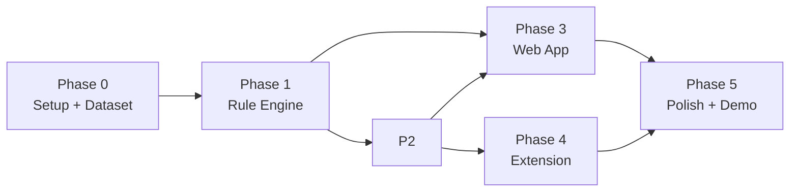

# Build Plan — Phases → File Deliverables

Maps `Phases.md` to concrete file-level work. Each phase: goal, file deliverables, task checklist, done-bar. Done-bars mirror `Phases.md` for consistency.

---

## Phase 0 — Setup & Dataset

**Goal:** Repo skeleton + frozen schema + dataset ready before any logic.

**File deliverables:**
- `backend/package.json` — add `hono`, `franc`, `tinyld`, `bun:sqlite` (built-in), `zod` (validation), dev `bun:test`
- `backend/.env.example` — env vars from `Architecture.md` §7
- `backend/src/config.ts` — env load + defaults
- `backend/src/engine/schema.ts` — TS types mirroring `Data_Schema.md`
- `backend/dataset.json` — 15–20 pairs per `Dataset_Spec.md` (fill pairs now)
- `web-app/` — `bun create vite` React + TS scaffold + Tailwind + `tailwind.config.ts` tokens from `Design.md` §11
- `chrome-ext/` — folder + `package.json` + `@crxjs/vite-plugin` setup (empty manifest ok)
- Root `README.md` — setup steps, env, run order

**Checklist:**
- [ ] `bun install` works in `backend/`
- [ ] `bun install` works in `web-app/`
- [ ] `bun run dev` (Vite) serves blank React app on `:5173`
- [ ] `dataset.json` validates against `Dataset_Spec.md` §3 schema (write a tiny `bun:test` loader)
- [ ] All 17 pairs written, including password + "greatest country!!!???" inclusions
- [ ] `.env.example` documented; `BACKEND_PORT`, `DB_PATH`, `LLM_*`, `CORS_ORIGINS` all present

**Done when:** Dataset exists + validates, schema types compile, both web-app + backend boot empty.

---

## Phase 1 — Rule Engine (Core Backend v1)

**Goal:** Deterministic detection working. Safety net + fastest demo win.

**File deliverables:**
- `backend/src/index.ts` — Hono app, CORS middleware, route wiring
- `backend/src/routes/health.ts` — `GET /health`, `GET /languages`
- `backend/src/routes/evaluate.ts` — `POST /evaluate` (rules-only path)
- `backend/src/engine/lang.ts` — `franc` + `tinyld` detect → ISO 639-1
- `backend/src/engine/rules/types.ts` — `Rule`, `RuleMatch` interfaces
- `backend/src/engine/rules/en-v1.ts` — all `en-v1` rules from `Rule_Engine.md` §2
- `backend/src/engine/rules/index.ts` — registry + `getRules(lang)`
- `backend/rules-data/en-v1.json` — JSON mirror of `en-v1.ts`
- `backend/src/engine/pipeline.ts` — orchestrate (rules-only path for now; LLM stub returns null)
- `backend/src/engine/merge.ts` — merge logic from `Data_Schema.md` §6 (rules-only branch active)
- `backend/src/db/sqlite.ts` — open + migration (history table)
- `backend/src/db/history.ts` — insert + query
- `backend/src/lib/validate.ts` — request validation (length, shape)
- `backend/src/lib/id.ts` — UUID v4 (use `crypto.randomUUID()`)
- `backend/tests/rules.test.ts` — run rules against `dataset.json`

**Checklist:**
- [ ] `POST /evaluate` returns full `EvaluateResponse` for rule-catchable cases
- [ ] `llm_judge === null` on all responses (LLM not wired yet)
- [ ] Password example: `en-v1.pii.password` fires, high confidence, score 85, band 4
- [ ] Bias "greatest country!!!???": Stage A + B fire, score 70, medium confidence
- [ ] Unsafe keyword cases: rule fires, high confidence
- [ ] Hallucination/unsupported-claims: rule may fire at low confidence or skip (LLM pending)
- [ ] Clean pairs: no rule fires, `risk_category=none`, score 0, verdict Pass
- [ ] `GET /health` returns `llm_enabled=false`
- [ ] `bun test` passes for all rule-catchable + clean cases
- [ ] SQLite history populated on each eval

**Done when:** API returns correct verdict for all rule-catchable + clean cases in dataset.

---

## Phase 2 — LLM-as-Judge Layer

**Goal:** Nuance for cases rules miss (subtle bias, hallucination, unsupported claims, non-English).

**File deliverables:**
- `backend/src/engine/llm.prompts.ts` — system prompt + user template + few-shots from `LLM_System_Inst.md` §§ 2-4 as exported consts
- `backend/src/engine/llm.ts` — OpenAI-compatible client, retry, parse, validate substring
- `backend/src/engine/pipeline.ts` — wire LLM into pipeline per `Rule_Engine.md` §3 routing
- `backend/src/engine/merge.ts` — full merge logic (rule + LLM combine branches)
- `backend/tests/pipeline.test.ts` — full pipeline against `dataset.json` (with + without `LLM_API_KEY`)

**Checklist:**
- [ ] System prompt in `llm.prompts.ts` matches `LLM_System_Inst.md` §2 verbatim
- [ ] LLM call uses `LLM_BASE_URL`, `LLM_API_KEY`, `LLM_MODEL` env vars
- [ ] `temperature: 0.1`, `max_tokens: 800`, `response_format: json_object`
- [ ] Retry up to `LLM_MAX_RETRIES` with backoff; fallback to rules-only on final fail
- [ ] Malformed JSON → regex extract → re-parse → rules-only fallback
- [ ] `flagged_phrase` validated as substring of `response`; reset to `""` if not
- [ ] `llm_judge` trace populated with `model`, `latency_ms`, `reason`
- [ ] Multilingual pair: routes to LLM, returns `none`, Pass
- [ ] Hallucination + unsupported-claims pairs: LLM catches them, Fail
- [ ] Subtle bias (no Stage B): LLM catches, Fail
- [ ] `bun test` passes both with `LLM_API_KEY` set and unset (degraded mode)
- [ ] `GET /health` reflects `llm_enabled` correctly

**Done when:** Full dataset passes through pipeline with correct verdicts, including multilingual case.

---

## Phase 3 — Web App (Developer Console)

**Goal:** Usable interface. Primary demo surface if extension lags.

**File deliverables:**
- `web-app/src/main.tsx` — React entry
- `web-app/src/App.tsx` — tab router (Manual / Batch / Dashboard)
- `web-app/src/tabs/ManualTest.tsx` — form + `POST /evaluate` + ResultCard
- `web-app/src/tabs/BatchTest.tsx` — file upload + parse + `POST /evaluate/batch` + results table + export
- `web-app/src/tabs/Dashboard.tsx` — `GET /history` + filters + table + pagination
- `web-app/src/components/ResultCard.tsx` — per `Design.md` §6.1
- `web-app/src/components/RiskBadge.tsx` — per `Design.md` §6.2
- `web-app/src/components/FlaggedPhrase.tsx` — per `Design.md` §6.3
- `web-app/src/components/SaferRewrite.tsx` — per `Design.md` §6.4
- `web-app/src/components/HistoryTable.tsx` — per `Design.md` §6.8
- `web-app/src/api/client.ts` — fetch wrapper + error mapping
- `web-app/src/types.ts` — mirror `Data_Schema.md` types
- `web-app/src/styles/tailwind.css` — tokens + base
- `web-app/tailwind.config.ts` — `Design.md` §11 tokens
- `web-app/vite.config.ts` — proxy `/api` to `:8787`

**Checklist:**
- [ ] Three tabs render, keyboard nav (arrows) works
- [ ] Manual Test: paste prompt+response, `Cmd+Enter` evaluates, ResultCard renders
- [ ] ResultCard shows badge, flagged phrase (mono), rationale, safer rewrite, metadata
- [ ] Pass case: flagged + rewrite sections hidden
- [ ] Loading state: spinner, disabled button, no UI freeze
- [ ] Error state: red banner with code + message, dismissible
- [ ] Batch Test: upload CSV/JSON, parse, run, table renders, export downloads
- [ ] Dashboard: filters work, pagination works, row click opens drawer
- [ ] Empty states per `Design.md` §7 (no history, backend offline, LLM disabled banner)
- [ ] `data-band="0..4"` attribute drives risk colors; no per-component color hardcoding
- [ ] A11y: focus rings, ARIA labels on badges, `aria-live` on result container
- [ ] Responsive: stacks on mobile, 2-col on desktop

**Done when:** Can demo entire risk-category walkthrough using only web app.

---

## Phase 4 — Chrome Extension

**Goal:** Passive detection on live AI chat. Differentiator.

**File deliverables:**
- `chrome-ext/manifest.json` — per `Extension_Integration.md` §1
- `chrome-ext/src/content/inject.ts` — observer + extract + badge inject
- `chrome-ext/src/content/sites/chatgpt.ts` — selectors + fallback chain
- `chrome-ext/src/content/sites/selectors.ts` — `SITES` map (ChatGPT ready, Gemini/DeepSeek stubs)
- `chrome-ext/src/background/sw.ts` — message handler + backend fetch
- `chrome-ext/src/api.ts` — shared message types
- `chrome-ext/src/popup/popup.html` + `popup.ts` — settings + privacy + health
- `chrome-ext/icons/` — 16/48/128 PNGs
- `chrome-ext/vite.config.ts` — `@crxjs/vite-plugin` build

**Checklist:**
- [ ] `bun run build` outputs `dist/` with bundled SW + content + manifest
- [ ] Loads unpacked, no manifest errors in `chrome://extensions`
- [ ] Popup shows privacy disclosure + health status (calls `/health`)
- [ ] On ChatGPT: new assistant message triggers observer
- [ ] Stream-complete detection works (waits, doesn't badge mid-stream)
- [ ] Extracts (last prompt, response), sends to backend via SW
- [ ] Badge injects in shadow DOM, scoped styles, host page unaffected
- [ ] Badge states render: Pass (green ✓), Fail (⚠ + score), Evaluating (spinner), Offline, Error
- [ ] Click badge → popover with category, flagged phrase, rationale, rewrite, copy button
- [ ] Idempotent — same message not re-evaluated unless "Re-evaluate" clicked
- [ ] Settings persist via `chrome.storage.local`; backend URL editable
- [ ] Try-catch on all handlers; selector miss logs warn, doesn't crash page
- [ ] Tested live on ChatGPT with at least one Fail-triggering prompt

**Done when:** Extension shows real-time badge on ChatGPT during a live test run with at least one flagged response.

---

## Phase 5 — Polish & Demo Prep

**Goal:** Bulletproof demo, not just functional.

**File deliverables:**
- Root `README.md` — setup, env, run order, demo quickstart
- `docs/Demo_Script.md` — see Phase 5 file (next)
- Optional: 2-min screen capture as fallback (`demo-fallback.mp4`, not committed — local only)

**Checklist:**
- [ ] Rehearse full demo script (see `Demo_Script.md`) start to finish, no live debugging
- [ ] Verify all 5 categories + multilingual + clean negative demo cleanly
- [ ] Record screen capture as backup (extension live on ChatGPT, walk through categories)
- [ ] Write 1-slide "known limitations" summary (language scope, flag-not-block, DOM fragility)
- [ ] Clean README: one-command backend start, one-command web-app start, extension load steps
- [ ] `.env.example` final, no secrets in repo, `dataset.json` validated
- [ ] Run `bun test` one final time — green
- [ ] Kill + restart backend + web-app + reload extension → demo still works from cold

**Done when:** Full demo runs end-to-end without live debugging.

---

## Dependency Graph



- Phase 2 unblocks 3 + 4 (they need full pipeline to demo).
- Phase 3 + 4 can parallelize if 2 people.
- Phase 5 needs 3 + 4 both done.

## Priority Cut Order (from Phases.md)

If time short, cut in this order (last cut = most important):

1. Extension multi-site support (keep ChatGPT only)
2. Batch test tab (manual test tab is enough)
3. Dashboard/history (nice-to-have)
4. LLM merge nuance (rules-only still demos 3/5 categories)

**Never cut:** dataset quality, password example, bias example — brief reference points judges check.

## Env / Keys Checklist (before any phase needs LLM)

- [ ] `LLM_BASE_URL` set (OpenAI default or Vultr endpoint)
- [ ] `LLM_API_KEY` set (or leave empty for rules-only dev)
- [ ] `LLM_MODEL` set
- [ ] `CORS_ORIGINS` includes `http://localhost:5173` + `chrome-extension://*`
- [ ] `DB_PATH` writable directory exists (`backend/data/`)

## Run Order (single command per terminal)

```bash
# Terminal 1 — backend
cd backend && bun run src/index.ts        # serves :8787

# Terminal 2 — web app
cd web-app && bun run dev                  # serves :5173, proxies /api

# Terminal 3 — extension build (watch)
cd chrome-ext && bun run build --watch    # outputs dist/

# Browser — load unpacked
chrome://extensions → Developer mode → Load unpacked → chrome-ext/dist
```
