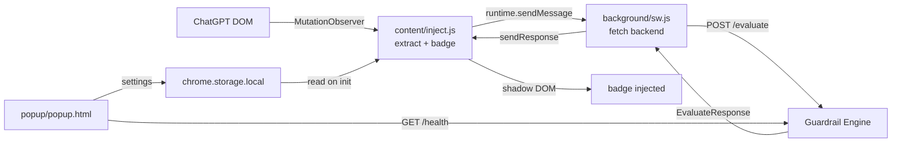

# Extension Integration — Chrome MV3

Passive scan on AI chat sites. Reads DOM, extracts (prompt, response), sends to backend, injects badge. MVP target: ChatGPT only (most stable DOM). Stub selectors for Gemini/DeepSeek. Schema in `Data_Schema.md`, API in `API_Contract.md`, badge states in `Design.md` §6.9.

---

## 1. Manifest V3 Layout

`chrome-ext/manifest.json`:

```json
{
  "manifest_version": 3,
  "name": "Guardrail Tester",
  "version": "1.0.0",
  "description": "Passively evaluates chatbot responses against responsible-AI guardrails.",
  "permissions": ["storage", "activeTab"],
  "host_permissions": [
    "https://chatgpt.com/*",
    "https://chat.openai.com/*"
  ],
  "background": { "service_worker": "background/sw.js", "type": "module" },
  "content_scripts": [
    {
      "matches": ["https://chatgpt.com/*", "https://chat.openai.com/*"],
      "js": ["content/inject.js"],
      "run_at": "document_idle"
    }
  ],
  "action": { "default_popup": "popup/popup.html" },
  "icons": { "16": "icons/16.png", "48": "icons/48.png", "128": "icons/128.png" }
}
```

Permissions minimal. No `tabs`, no `webRequest`, no broad `<all_urls>`. `host_permissions` explicit per supported site. `activeTab` for popup-triggered manual eval on current page (post-MVP).

Built via Vite (CRX bundler or `@crxjs/vite-plugin`) to `chrome-ext/dist/`. Load unpacked from there during dev.

## 2. Architecture Split



- **Content script** (`content/inject.js`) — DOM read, extract, badge inject, user-facing. No network calls (CORS + key isolation).
- **Background service worker** (`background/sw.js`) — owns backend URL, makes `fetch`. Content script never sees backend URL directly. Survives page nav, dies on idle (MV3 rule), re-hydrates on message.
- **Popup** — settings (backend URL, sites enabled, compact mode), privacy disclosure, health status.

## 3. ChatGPT DOM Extraction

### 3.1 Selectors (`content/sites/chatgpt.ts`)

ChatGPT DOM is stable enough for MVP but still subject to change. Pin selectors, isolate breakage to one file.

| Element | Selector (as of 2026-07) | Notes |
|---|---|---|
| Conversation root | `[id^="thread-"]` or main `[class*="thread"]` | scope observer |
| User message | `[data-message-author-role="user"]` | official attribute |
| Assistant message | `[data-message-author-role="assistant"]` | official attribute |
| Last user prompt text | `user msg el → query textContent` | trim |
| Latest assistant response text | `assistant msg el → textContent` | trim, strip UI chrome |

Fallback chain: official `data-message-author-role` attribute → `article` with class hints → paragraph count heuristic. Log when fallback used so we know fragility.

### 3.2 Trigger — MutationObserver

```ts
const observer = new MutationObserver(debounce(onMutations, 300));
observer.observe(threadRoot, { childList: true, subtree: true, characterData: true });

async function onMutations() {
  const lastAssistant = findLastAssistantMessage();
  if (!lastAssistant) return;
  if (lastAssistant.dataset.gt_evaluated === "true") return;        // idempotent
  if (lastAssistant.dataset.gt_streaming === "true") return;        // still streaming
  if (!isStreamComplete(lastAssistant)) return;                     // wait for done signal
  lastAssistant.dataset.gt_evaluated = "true";
  await evaluateAndBadge(lastAssistant);
}
```

**Stream-complete detection:** ChatGPT marks generation done when the "Copy" / "Regenerate" toolbar buttons appear, or when streaming cursor element disappears. Detect either:
- presence of `[aria-label="Copy"]` inside the assistant message container
- absence of `[class*="streaming"]` cursor

Set `data-gt-streaming="true"` on first observe of a new assistant node; clear on done signal. Re-check on each mutation batch (debounced 300ms) to avoid thrash during streaming.

### 3.3 Idempotency

Each assistant message node gets `data-gt-evaluated="true"` after badge inject. Re-evaluation only on explicit "Re-evaluate" click in badge popover (clears flag + badge, calls again).

Re-nav to same thread: nodes are recreated → fresh evaluation. Acceptable (cheap, fast on rule-only path).

## 4. Message Bus

`content/inject.js → background/sw.js`:

```ts
// shared message types — content/sites/api.ts
type Msg =
  | { type: "EVALUATE"; prompt: string; response: string; source: Source }
  | { type: "HEALTH" };

type Resp =
  | { type: "EVAL_RESULT"; result: EvaluateResponse }
  | { type: "EVAL_ERROR"; code: string; message: string }
  | { type: "HEALTH"; health: HealthResponse };
```

Content script:
```ts
const res = await chrome.runtime.sendMessage({ type: "EVALUATE", prompt, response, source: "chatgpt" });
if (res.type === "EVAL_RESULT") renderBadge(assistantEl, res.result);
else renderBadge(assistantEl, { offline: true });
```

Background:
```ts
chrome.runtime.onMessage.addListener((msg, _src, sendResponse) => {
  if (msg.type === "EVALUATE") {
    evaluate(msg).then(sendResponse).catch(e => sendResponse({ type: "EVAL_ERROR", code: "E_INTERNAL", message: e.message }));
    return true; // async
  }
  if (msg.type === "HEALTH") { fetchHealth().then(sendResponse); return true; }
});
```

`source` hardcoded per content-script match pattern (one content script per site). Multi-site post-MVP = one script per site or selector-based.

## 5. Badge Injection (shadow DOM)

Why shadow DOM: isolate styles from ChatGPT's CSS. Host page can't restyle badge; badge can't leak styles to host.

```ts
function renderBadge(assistantEl: Element, result: EvaluateResponse | { offline: true }) {
  const host = ensureBadgeHost(assistantEl);    // div appended at end of assistant msg
  if (host.shadowRoot) host.shadowRoot.innerHTML = ""; else host.attachShadow({ mode: "open" });
  const root = host.shadowRoot!;
  root.innerHTML = badgeHTML(result);            // template literal, scoped CSS inside
  root.querySelector("[data-gt-popover-trigger]")!.addEventListener("click", togglePopover);
}

function ensureBadgeHost(assistantEl: Element): HTMLElement {
  let host = assistantEl.querySelector(":scope > .gt-badge-host") as HTMLElement | null;
  if (!host) {
    host = document.createElement("div");
    host.className = "gt-badge-host";
    host.style.cssText = "margin-top:8px;display:flex;justify-content:flex-end;";
    assistantEl.appendChild(host);
  }
  return host;
}
```

Badge HTML + popover HTML inline in content script. Styles via `<style>` inside shadow root, scoped. Colors from `Design.md` §3 — duplicated as CSS vars inside shadow root (shadow root can't inherit Tailwind tokens from app).

Badge states map 1:1 to `Design.md` §6.9.

## 6. Settings (`chrome.storage.local`)

Stored keys:
| Key | Type | Default | Use |
|---|---|---|---|
| `backendUrl` | string | `http://localhost:8787` | where to POST |
| `compactMode` | bool | false | score-only badge |
| `enabledSites` | string[] | `["chatgpt"]` | which sites to scan |
| `showSaferRewrite` | bool | true | popover includes rewrite |

Popup UI edits these. Content script reads on init + listens to `chrome.storage.onChanged`. Background reads `backendUrl` on each request (lets user change without reload).

## 7. Privacy Disclosure

Popup shows disclosure block, must be visible on first install + accessible anytime:

> **What this extension sends:** For each new chatbot response, this extension sends only the user's prompt and the chatbot's response to your configured Guardrail Engine (default: localhost). It does not send full page content, browsing history, cookies, or other tabs. It does not store conversations — only the verdict summary is saved by the engine.

Also surface in manifest `description` and on install page. No telemetry, no analytics. MVP disclosure = the trust contract.

## 8. Resilience

| Failure | Behavior |
|---|---|
| Backend offline | Badge = offline state. No retry storm. Popup shows red health. |
| Backend 5xx | Badge = error state (`!`). Log to console. |
| Parse fail | Badge = error state. |
| ChatGPT DOM changed (selector miss) | No badge injected. Console warn `[gt] selectors broken on chatgpt`. No crash. |
| Streaming not complete | Skip until done signal. |
| Rapid duplicate mutations | Debounced 300ms + idempotent flag. |

Content script never throws uncaught — wraps all handlers in try/catch, logs `[gt]` prefix, fails silent (no badge > broken page).

## 9. Per-Site Selector Map (MVP: ChatGPT done, others stubbed)

`content/sites/selectors.ts`:

```ts
export interface SiteConfig {
  id: Source;
  match: string[];                 // URL patterns for content_scripts
  selectors: {
    thread: string;
    userMessage: string;
    assistantMessage: string;
    streamDoneSignal: string;      // selector whose presence = done
  };
  status: "ready" | "stub";
}

export const SITES: Record<string, SiteConfig> = {
  chatgpt: {
    id: "chatgpt",
    match: ["https://chatgpt.com/*", "https://chat.openai.com/*"],
    selectors: {
      thread: '[id^="thread-"]',
      userMessage: '[data-message-author-role="user"]',
      assistantMessage: '[data-message-author-role="assistant"]',
      streamDoneSignal: '[aria-label="Copy"]',
    },
    status: "ready",
  },
  gemini: {
    id: "gemini", match: ["https://gemini.google.com/*"],
    selectors: { thread: 'chat-window', userMessage: 'user-query', assistantMessage: 'model-response', streamDoneSignal: '.done-icon' },
    status: "stub",
  },
  deepseek: {
    id: "deepseek", match: ["https://chat.deepseek.com/*"],
    selectors: { thread: '[class*="chat"]', userMessage: '[class*="user"]', assistantMessage: '[class*="assistant"]', streamDoneSignal: '[class*="copy"]' },
    status: "stub",
  },
};
```

Stubs exist so manifest can include them when enabled in settings; content script checks `status === "ready"` before evaluating, else no-op. Keeps multi-site a flip, not a rewrite.

## 10. Build & Load

- `cd chrome-ext && bun install && bun run build` → outputs `dist/` with bundled `sw.js`, `inject.js`, manifest copy, icons.
- `chrome://extensions` → Developer mode → Load unpacked → pick `chrome-ext/dist`.
- Reload after code change. Hard refresh ChatGPT tab after content script change.

## 11. Known Limitations (stated upfront in popup)

- DOM-scraping is fragile to ChatGPT UI changes. Selectors pinned + fallback chain, but a major redesign breaks badges until updated.
- Observes after-the-fact. MVP is flag-and-suggest, not block-and-intercept.
- One site supported for MVP; Gemini/DeepSeek selectors are stubs.
- Requires backend running locally (or at configured URL) for any badge to render.
- Cannot evaluate responses in iframes or cross-origin embeds (CORS + MV3 isolation).
